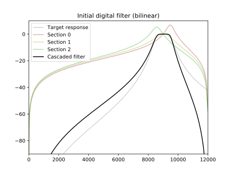
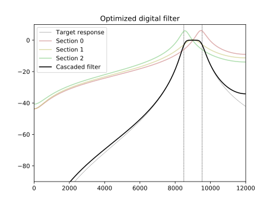

# optimal-filter
Using machine learning algorithms for recursive digital filter optimization

This is an example of using automatic differentiation and optimization methods of TensorFlow
to design a 6-order gigital band-pass IIR filter with frequency response as close as possible
to the analog filter of the same order.

Initial digital filter is computed using bi-linear transform:

Adam algorithm is used to make the digital filter's frequency response closer to analog filter.

